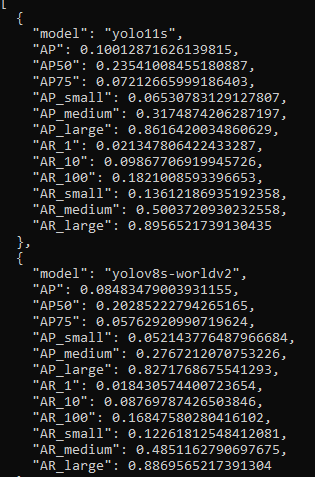
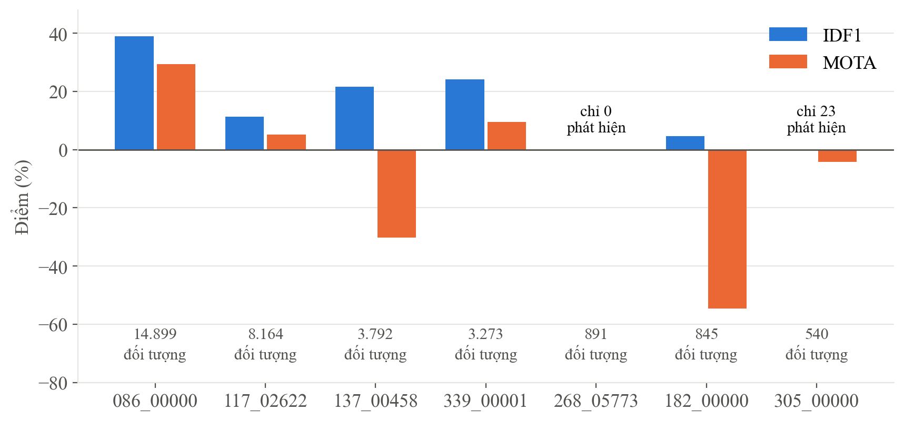
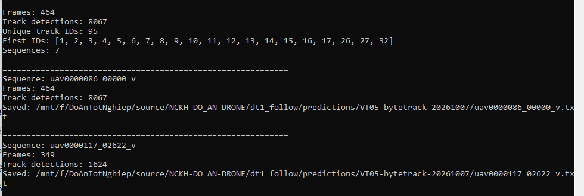
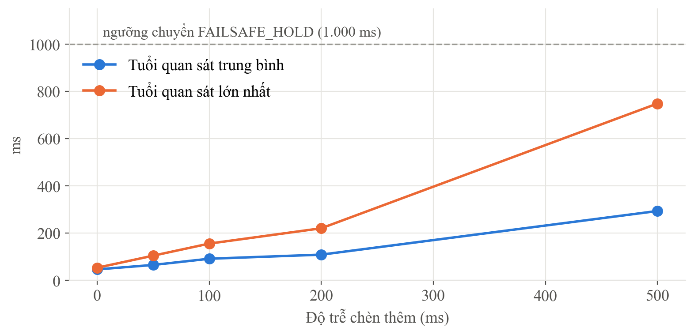

**Đề tài con 1 (ĐT1):** Drone tự động bám theo người trên nền tảng PX4

**Người thực hiện:** Nguyễn Quốc Việt (TV1) · **Đợt test:** 04/10 – 11/10/2026

**Tài liệu này được lập bởi:** Nguyễn Văn Vinh (người kiểm tra chéo ĐT1), tổng hợp từ
*Báo cáo kỹ thuật VT-02 đến VT-09* của Việt và đối chiếu với kho mã nguồn
[github.com/VINH1811/NCKH-DO_AN-DRONE](https://github.com/VINH1811/NCKH-DO_AN-DRONE).
**Cần Việt xác nhận trước khi nộp.**

# Phần A. Tổng quan

## A.1. ĐT1 giải quyết bài toán gì

ĐT1 phụ trách khâu cuối của chuỗi: sau khi nhận mục tiêu từ ĐT2, **drone tự bay bám
theo người đó**. Muốn vậy cần ba khả năng: **phát hiện người** trong ảnh từ drone,
**giữ đúng người** qua các khung hình (tracking), và **điều khiển drone** theo vị trí
người trong ảnh một cách an toàn trên nền PX4.

## A.2. Các nhiệm vụ và mức độ xác minh

Cột **Xác minh** cho biết kết quả đã được kiểm tra độc lập trên git hay chưa:
**Đã kiểm chứng** — tính lại hoặc chạy lại khớp; **Chưa kiểm chứng được** — có mô tả
nhưng bằng chứng không có trên git; **Cần sửa** — kiểm tra phát hiện sai lệch.

| Mã | Nhiệm vụ | Kết quả Việt báo cáo | Xác minh |
|---|---|---|---|
| VT-02 | Chạy PX4 mô phỏng, bay tự động | Đủ chu trình cất cánh → bay tự động → hạ cánh | Chưa kiểm chứng được (log không có trên git) |
| VT-03 | So sánh hai detector | YOLO11s tốt hơn YOLO-World, ít bộ nhớ hơn 7 lần | **Đã kiểm chứng** |
| VT-04 | Đóng gói detector cho ĐT2, ĐT3 (M3) | Gói chạy được, khoá mã băm | **Đã kiểm chứng** |
| VT-05 | Đánh giá tracking 7 video | IDF1 0,2699, MOTA 0,1078 | **Đã kiểm chứng** |
| VT-06 | Đưa quan sát vào mô phỏng bay | Chuyển vị trí người thành lệnh xoay và tiến | Chưa kiểm chứng được |
| VT-07 | Độ trễ, mất quan sát, an toàn | Chịu trễ 500 ms; mất dấu > 1 s thì treo tại chỗ | Cần sửa cách mô tả |
| VT-08 | Đóng băng đánh giá (M10) | Khoá số liệu, lưu kết quả, video demo | **Cần sửa** |
| VT-09 | Gói M11 và kiểm tra chéo ĐT3 | Recall@1 = 64%, Recall@5 = 96% | **Cần làm lại** |

# Phần B. Chi tiết từng nhiệm vụ

## B.1. VT-02 — Chạy PX4 mô phỏng và bay tự động

**Mục đích.** Chứng minh có thể điều khiển drone tự động trên máy tính mà chưa cần drone
thật.

**Vì sao cần.** Thử thuật toán bám người trên drone thật ngay từ đầu là nguy hiểm. Mô
phỏng cho phép thử sai thoải mái.

**Cách làm.** Chạy PX4 SITL với mô hình drone X500 trong Gazebo, điều khiển qua chế độ
Offboard theo chu trình: bật động cơ → cất cánh → chuyển Offboard → hạ cánh → tắt động cơ.

**Kết quả.** Báo cáo VT-02 ghi đủ lệnh chạy và kết quả từng bước. Việt có lưu ý đúng
rằng các tham số bỏ qua kiểm tra pin và mất sóng **chỉ dùng trong mô phỏng**, không được
cài lên drone thật.

**Xác minh.** Log bay `10_57_11.ulg` (49 MB) không có trên git — đuôi `.ulg` bị chặn trong
`.gitignore`. Chưa kiểm chứng được độc lập.

**Dẫn chứng:** [reports/VT02-offboard-20261004.md](https://github.com/VINH1811/NCKH-DO_AN-DRONE/blob/main/dt1_follow/reports/VT02-offboard-20261004.md)

## B.2. VT-03 — So sánh hai detector

**Mục đích.** Chọn mô hình phát hiện người tốt nhất cho ảnh chụp từ drone.

**Vì sao cần.** Detector là đầu vào của mọi khâu sau. Phát hiện sót người thì tracking và
bám theo đều hỏng.

**Cách làm.** So YOLO11s với YOLO-World trên 548 ảnh VisDrone. Đo độ chính xác (AP), độ
trễ và bộ nhớ GPU. Dùng **so sánh cặp trên từng ảnh** để kết luận.

{width=48%}

**Kết quả.**

| | YOLO11s | YOLO-World |
|---|---|---|
| AP | **0,100** | 0,085 |
| AP người nhỏ | 0,065 | 0,052 |
| Bộ nhớ GPU đỉnh | **94 MB** | 688 MB |
| Độ trễ p50 | 25,4 ms | 26,7 ms |

**Đọc kết quả thế nào.** Hiệu cặp AP theo ảnh là +1,58 điểm [+1,01 – +2,17], không chứa 0
→ YOLO11s tốt hơn thật, lại nhẹ hơn 7 lần. Đây là lựa chọn có căn cứ.

**Xác minh: đã kiểm chứng.** Tôi chạy lại so sánh cặp bằng công cụ chung của nhóm trên file
AP từng ảnh của Việt, ra +1,58 — khớp với +1,576 Việt tự tính.

## B.3. VT-04 — Đóng gói detector cho ĐT2 và ĐT3 (mốc M3)

**Mục đích.** Giao cho ĐT2 và ĐT3 một module phát hiện và cắt ảnh người dùng chung.

**Vì sao cần.** Để ba đề tài dùng cùng một detector, cùng cấu hình — kết quả mới nối được.

**Cách làm.** YOLO11s với ngưỡng tin cậy 0,25, cắt ảnh người có lề 10%, kèm thông tin khung
và độ tin cậy. Khoá mã băm trọng số.

**Kết quả và xác minh: đã kiểm chứng.** Mã băm trọng số khớp (`85a76fe8…`). Tôi chạy thử lớp
`PersonDetector` của Việt trên 4 khung hình khuôn viên: nạp được, mỗi khung tìm 9–17
người, trả đúng định dạng, khoảng 30–35 ms mỗi khung.

**Dẫn chứng:** [packages/M3-detector-crop-20261006/](https://github.com/VINH1811/NCKH-DO_AN-DRONE/tree/main/dt1_follow/packages/M3-detector-crop-20261006), [configs/vt04_detector.yaml](https://github.com/VINH1811/NCKH-DO_AN-DRONE/blob/main/dt1_follow/configs/vt04_detector.yaml)

## B.4. VT-05 — Đánh giá tracking trên 7 video

**Mục đích.** Đo khả năng **giữ đúng người** qua các khung hình bằng YOLO11s + ByteTrack.

**Vì sao cần.** Drone bám người cần biết người ở khung này là người nào ở khung trước.

**Cách làm.** Chạy trên 7 video VisDrone MOT-val, đo IDF1 (giữ đúng danh tính) và MOTA
(độ chính xác tổng thể) — càng gần 100% càng tốt.

{width=85%}

**Kết quả.** Tổng 7 video: **IDF1 = 26,99%, MOTA = 10,78%, 213 lần đổi danh tính.**

**Đọc kết quả thế nào.** Kết luận đúng của Việt: **nút thắt nằm ở detector, không ở
tracker**. Một video không có phát hiện nào (891 người), một video chỉ 23 phát hiện
(540 người) — người từ trên cao quá nhỏ, tracker không có gì để nối. Kết quả cũng rất
chênh giữa các video: một video chiếm 46% số người cần theo dõi.

**Xác minh: đã kiểm chứng.** Tôi tính lại IDF1, MOTA và số lần đổi danh tính từ số liệu
từng video — khớp chính xác.

**Dẫn chứng:** [reports/VT05-tracking-20261007.md](https://github.com/VINH1811/NCKH-DO_AN-DRONE/blob/main/dt1_follow/reports/VT05-tracking-20261007.md), [metrics/VT05-tracking-20261007.csv](https://github.com/VINH1811/NCKH-DO_AN-DRONE/blob/main/dt1_follow/metrics/VT05-tracking-20261007.csv)

## B.5. VT-06 — Đưa quan sát vào mô phỏng bay

**Mục đích.** Biến vị trí người trong ảnh thành lệnh điều khiển drone.

**Cách làm.** Lấy vị trí người qua các khung của một video VisDrone, tính độ lệch so với
tâm ảnh, đổi thành vận tốc xoay và vận tốc tiến. Việt ghi rõ đây là **phát lại một chiều**
(open-loop) — drone không ảnh hưởng ngược lại hình ảnh — một cách nói trung thực.

**Xác minh: chưa kiểm chứng được.** Mã VT-06 trên git chỉ **tính lệnh và ghi ra file CSV**
(`predictions/VT06_sitl_setpoints.csv`); không có đoạn mã nào gửi lệnh tới PX4. Log bay
`VT06_sitl_run.ulg` (863 MB) không có trên git. Cần Việt bổ sung cách các lệnh trong CSV
được đưa vào PX4.

## B.6. VT-07 — Độ trễ, mất quan sát và an toàn

**Mục đích.** Bảo đảm drone an toàn khi tín hiệu hình ảnh bị trễ hoặc mất mục tiêu.

**Cách làm.** Tách riêng luồng gửi lệnh duy trì (heartbeat) 20 lần mỗi giây khỏi luồng
nhận diện. Chèn độ trễ 0–500 ms và mô phỏng mất quan sát 2 giây.

**Kết quả.** Với trễ 500 ms, quan sát cũ nhất là 748 ms, vẫn dưới ngưỡng 1 giây nên không
chuyển chế độ. Mất quan sát 2 giây thì chuyển sang treo tại chỗ (FAILSAFE_HOLD) rồi khôi
phục được.

**Xác minh: cần sửa cách mô tả.** Thiết kế đúng hướng. Nhưng thí nghiệm chạy bằng lớp
`OffboardControllerSim` viết bằng Python, **không kết nối PX4**. Nên "không rớt chế độ
Offboard" là do logic của chính script quyết định, chưa được PX4 thật kiểm chứng. Báo cáo
cần ghi "mô phỏng logic", không ghi "trong SITL".

## B.7. VT-08 — Đóng băng đánh giá (mốc M10)

**Mục đích.** Khoá số liệu và lưu kết quả thô để người khác kiểm tra.

**Xác minh: cần sửa.** Script `vt08_eval_freeze.py` **không chạy lại đánh giá**; các con số
được ghi thẳng vào mã. IDF1, MOTA và số lần đổi danh tính lấy đúng từ VT-05 nên vẫn
đúng. Nhưng:

| Vấn đề | Chi tiết |
|---|---|
| Khoảng tin cậy | Ghi tay, không có mã tính ra. Tính lại theo video: IDF1 [12,1 – 36,0]%, MOTA [−20,3 – 24,5]% — rộng hơn 4–8 lần |
| n = 2.746 | Log VT-05 cho tổng **2.846 khung hình** — nhiều khả năng gõ nhầm, cần Việt xác nhận |
| Heartbeat 20 Hz | Là tần số **cài đặt**, không phải số đo |
| Video demo | Vẽ lại từ kết quả trên nền xám, chữ "Heartbeat 20Hz OK" cố định; chưa có trên git |
| Kết quả thô | Chỉ có 1/7 video, không tính lại được bảng 7 video |

**Dẫn chứng:** [docs/crosscheck/dt1_follow.md](https://github.com/VINH1811/NCKH-DO_AN-DRONE/blob/main/docs/crosscheck/dt1_follow.md) (biên bản kiểm tra chéo)

## B.8. VT-09 — Gói M11 và kiểm tra chéo ĐT3

**Mục đích.** Bàn giao gói cuối và kiểm tra độc lập kết quả của Lương.

**Xác minh: phần kiểm tra chéo ĐT3 phải làm lại.** Script `vt09_crosscheck_dt3.py` tìm file
`M10_predictions.json` của ĐT3. File này **không tồn tại**. Khi không thấy, script **tự tạo
50 truy vấn giả bằng số ngẫu nhiên**, đặt sẵn khoảng 68% đáp án ở hạng 1, rồi tính ra
Recall@1 = 64% và Recall@5 = 96%.

| | Biên bản VT-09 ghi | Thực tế |
|---|---|---|
| Dữ liệu kiểm tra | "Kết quả bàn giao M10 của Lương" | 50 truy vấn tự sinh, nội dung "Mô tả kiểm thử mục tiêu số 1…" |
| Recall@1 | 64% | Của Lương thật: **2,86%** trên 70 truy vấn |
| Kết luận | "Khớp với số liệu công bố: hợp lệ" | Lương chưa từng công bố con số này |

Nghĩa là **ĐT3 chưa được kiểm tra chéo**. Cần làm lại trên file thật của Lương:
`dt3_retrieval/predictions/LG02-mclip-secondpaper-20261005/dev/per_query.csv`, và bỏ con
số 64%/96% khỏi báo cáo.

# Phần C. Đối chiếu checklist tái lập

| Mục | Trạng thái | Ghi chú |
|---|---|---|
| Commit hash của lần chạy | Một phần | Có `env/` cho VT-06 → VT-09; CSV ghi `commit = auto` |
| Lệnh chạy lại từ README | Chưa | README chưa có lệnh VT-05, VT-08 |
| Config từng thí nghiệm | Một phần | Có cho VT-04, VT-09 |
| Checkpoint và SHA256 | Đạt | Trong gói M3; file ở gốc `checkpoints/SHA256SUMS` còn rỗng |
| Precision | Đạt | FP32 |
| Phiên bản thư viện, GPU | Đạt | `env/*/pip_freeze.txt`, `nvidia_smi.txt` |
| Split theo protocol gốc | Đạt | VisDrone val chính thức |
| Ngưỡng chọn trên validation | Chưa | Cùng tập val vừa chọn detector vừa báo cáo |
| Dự đoán thô đã lưu | Một phần | VT-03 đủ; VT-05 chỉ 1/7 video |
| Metrics theo mẫu 17 cột | Một phần | VT-08 đạt; VT-05, VT-07, VT-09 chưa |
| n, mức ngẫu nhiên, CI | Một phần | VT-03 đạt; VT-08 CI ghi tay |
| Latency p50/p95 | Một phần | Có ở VT-03; chưa có lịch GPU riêng |
| Báo cáo ngắn | Đạt | |
| Kiểm tra chéo rút gọn | **Chưa đạt** | Phần ĐT3 chạy trên dữ liệu tự sinh |

# Phần D. Việc cần làm trước khi nộp

1. **Làm lại kiểm tra chéo ĐT3** trên `per_query.csv` thật của Lương; bỏ 64%/96%.
2. **Sửa VT-08:** bỏ khoảng tin cậy ghi tay hoặc tính lại bằng mã; xác nhận n là 2.746 hay
   2.846; ghi heartbeat là tham số cài đặt; sửa mô tả video demo.
3. **Sửa mô tả VT-07** thành "mô phỏng logic bằng Python".
4. **Bổ sung bằng chứng VT-02, VT-06:** đưa log lên nơi lưu chung hoặc ghi mã băm, và mô tả
   cách lệnh CSV được đưa vào PX4.
5. Commit kết quả thô **đủ 7 video** VT-05 để kiểm tra chéo đầy đủ 12–13/10.

# Kết luận

Phần **phát hiện người và tracking** của ĐT1 vững: chọn YOLO11s có căn cứ thống kê, gói M3
chạy được, kết quả tracking tính lại khớp, và phân tích nút thắt ở detector là đúng.
Phần **điều khiển bay và an toàn** đã có thiết kế hợp lý nhưng mới ở mức mô phỏng logic,
chưa có bằng chứng chạy với PX4 trên git. Phần **đóng gói kết quả** (VT-08, VT-09) cần sửa
trước khi nộp, nhất là kiểm tra chéo ĐT3.
