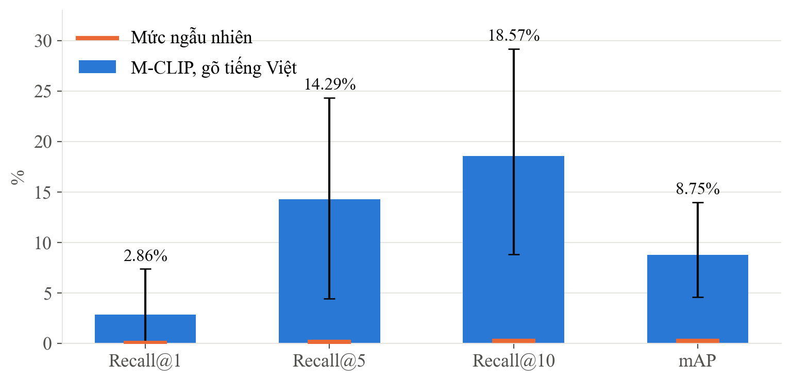
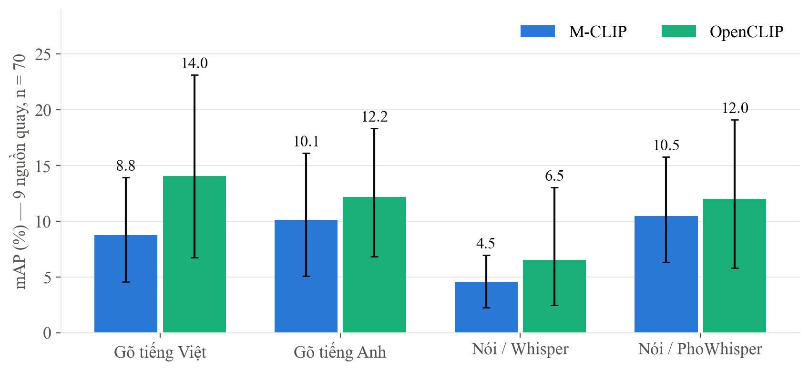
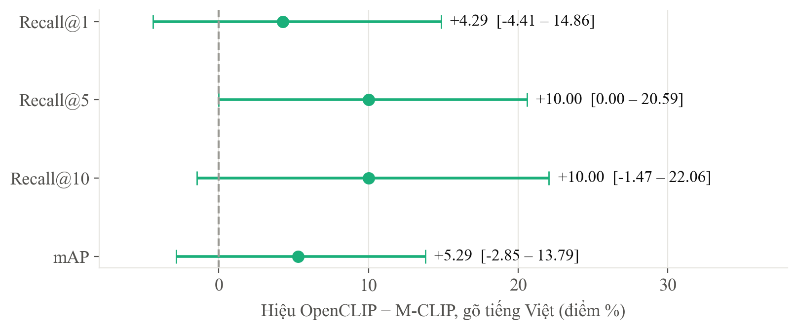

**Đề tài con 3 (ĐT3):** Tìm người theo mô tả tiếng Việt trên hệ đa camera

**Người thực hiện:** Bạch Ngọc Lương (TV3) · **Đợt test:** 04/10 – 11/10/2026

**Tài liệu này được lập bởi:** Nguyễn Văn Vinh, tổng hợp từ *Báo cáo tiến độ và minh
chứng ĐT3* của Lương (lập ngày 09/10) và đối chiếu với kho mã nguồn
[github.com/VINH1811/NCKH-DO_AN-DRONE](https://github.com/VINH1811/NCKH-DO_AN-DRONE),
cập nhật các quy ước nhóm chốt sau ngày 09/10. **Cần Lương xác nhận trước khi nộp.**

# Phần A. Tổng quan

## A.1. ĐT3 giải quyết bài toán gì

ĐT3 là khâu **đầu** của chuỗi: người dùng **mô tả bằng lời** người cần tìm (gõ hoặc nói
tiếng Việt), hệ thống tìm trong ảnh từ nhiều camera và trả về **danh sách ứng viên** —
camera nào, lúc nào. Danh sách này giao cho ĐT2 để bàn giao sang drone.

## A.2. Các nhiệm vụ và trạng thái

| Mã | Nhiệm vụ | Trạng thái | Kết quả một dòng |
|---|---|---|---|
| LG-02 | Đo mức tìm kiếm ban đầu (baseline) | Xong | 9 nguồn quay: Recall@5 14,29%, mAP 8,75%; vượt ngẫu nhiên |
| LG-03 | So 2 mô hình × 4 kiểu truy vấn | Xong | Chưa phân biệt được hai mô hình; nói qua Whisper kém hơn gõ có ý nghĩa |
| LG-04 | Dựng pipeline cho pilot | Mã xong, chưa chạy thật | 12/12 kiểm thử đạt |
| LG-05, LG-06 | Chạy pipeline trên pilot, bộ truy vấn M7 | Chưa làm được | Pilot chưa quay |
| LG-07, LG-08 | Chọn ngưỡng, test | Chưa làm | Phụ thuộc pilot |
| M8 | Danh sách ứng viên giao ĐT2 | Chưa có | Chuỗi demo ĐT3 → ĐT2 chưa nối được |
| LG-09 | Báo cáo, kiểm tra chéo ĐT2 | Báo cáo xong; **kiểm tra chéo chưa làm** | |

## A.3. Thuật ngữ cần biết

| Thuật ngữ | Nghĩa |
|---|---|
| **Recall@k** | Tỉ lệ câu mô tả mà người đúng nằm trong **k** kết quả đầu. Recall@5 = 14% nghĩa là 1/7 số lần người đúng nằm trong 5 ảnh đầu |
| **mAP** | Điểm tổng hợp theo thứ hạng của người đúng; ở đây bằng trung bình của 1/(hạng của người đúng) |
| **Dev / test** | Dev dùng để thử và chọn cấu hình; test giữ kín, chỉ mở một lần sau khi khoá cấu hình |
| **Mức ngẫu nhiên** | Điểm nếu chọn bừa trong gallery — ở đây chỉ 0,02–0,23% vì gallery có 4.272 người |
| **So sánh cặp** | So hai cách trên cùng từng câu; khoảng tin cậy của hiệu chứa 0 thì chưa phân biệt được |

# Phần B. Chi tiết từng nhiệm vụ

## B.1. LG-02 — Đo mức tìm kiếm ban đầu

**Mục đích.** Biết mô hình có sẵn tìm người theo mô tả tiếng Việt được tới đâu.

**Vì sao cần.** Là mốc để so mọi cải tiến sau.

**Cách làm.** Dùng gói dữ liệu M1 (ĐT2 giao). Chia 250 câu mô tả thành **76 câu dev** và
**174 câu test**, giữ các câu cùng một người về cùng một phía. Mô hình M-CLIP ViT-L/14,
tìm theo người (lấy ảnh giống nhất của mỗi người). **Không mở tập test.**

| Chỉ số | Kết quả | Khoảng tin cậy 95% | Mức ngẫu nhiên |
|---|---|---|---|
| Recall@1 | 2,86% (2/70) | [0,00 – 7,35] | 0,023% |
| Recall@5 | 14,29% | [4,41 – 24,32] | 0,117% |
| Recall@10 | 18,57% | [8,82 – 29,17] | 0,234% |
| mAP | 8,75% | [4,55 – 13,94] | 0,209% |

**Đọc kết quả thế nào.**

- Recall@5, Recall@10 và mAP **vượt ngẫu nhiên rõ** — cận dưới cao hơn mức ngẫu nhiên
  hàng chục lần.
- **Recall@1 cũng vượt ngẫu nhiên.** Báo cáo ngày 09/10 của Lương ghi "chưa đủ bằng chứng"
  vì khoảng bootstrap chạm 0. Theo quy tắc nhóm chốt sau đó (README mục 4.4), với chỉ số
  hiếm lần đúng thì kết luận dựa vào **kiểm định hoán vị**: p = 0,000135 → vượt ngẫu nhiên
  thật. Khoảng bootstrap chạm 0 chỉ vì có 2 lần đúng, không phải vì mô hình đoán bừa.
- Con số tuyệt đối còn thấp: cứ 7 câu mô tả thì khoảng 1 câu có người đúng trong 5 kết quả
  đầu. Đây là bài toán khó — tìm 1 người giữa 4.272.

**Dẫn chứng.**

| File | Nội dung |
|---|---|
| [metrics/LG02_baseline_summary.csv](https://github.com/VINH1811/NCKH-DO_AN-DRONE/blob/main/dt3_retrieval/metrics/LG02_baseline_summary.csv) | Kết quả, khoảng tin cậy, mức ngẫu nhiên, độ trễ |
| [predictions/LG02-.../dev/per_query.csv](https://github.com/VINH1811/NCKH-DO_AN-DRONE/blob/main/dt3_retrieval/predictions/LG02-mclip-secondpaper-20261005/dev/per_query.csv) | Hạng của người đúng cho từng câu |
| [data/splits/LG02_split_manifest.csv](https://github.com/VINH1811/NCKH-DO_AN-DRONE/blob/main/dt3_retrieval/data/splits/LG02_split_manifest.csv) | Câu nào thuộc dev, câu nào thuộc test |

## B.2. LG-03 — So 2 mô hình × 4 kiểu truy vấn

**Mục đích.** Trả lời: mô hình nào tốt hơn? Gõ tiếng Việt, dịch sang tiếng Anh, hay nói
thì tốt hơn?

**Vì sao cần.** Đề tài hướng tới **tìm bằng giọng nói tiếng Việt**. Cần biết nói thì mất
bao nhiêu so với gõ, và mô hình nào hợp với tiếng Việt.

**Cách làm.** Trên cùng 76 câu dev: M-CLIP so với OpenCLIP đa ngôn ngữ; bốn kiểu truy vấn
— gõ tiếng Việt, gõ tiếng Anh (bản dịch đã rà soát), nói qua Whisper, nói qua PhoWhisper.
So sánh bằng **so sánh cặp trên cùng câu**.

**Đọc kết quả thế nào.**

- **Chưa phân biệt được hai mô hình.** OpenCLIP có điểm cao hơn (mAP 14,04% so với 8,75%),
  nhưng khoảng tin cậy của hiệu chứa 0 ở cả bốn kiểu truy vấn. Lương đã viết đúng: không
  được kết luận OpenCLIP thắng.
- **Nói qua Whisper kém hơn gõ một cách có ý nghĩa** — mAP giảm 4,21 điểm [−8,35 – −1,01]
  với M-CLIP và 7,52 điểm [−12,11 – −3,78] với OpenCLIP.
- **Nói qua PhoWhisper thì không kém gõ có ý nghĩa** — +1,70 [−2,06 – +5,73] với M-CLIP,
  −2,04 [−5,54 – +1,32] với OpenCLIP. → **Dùng PhoWhisper thì chưa thấy tìm bằng giọng nói kém
  hơn gõ phím.** Khoảng tin cậy còn rộng (khoảng ±5 điểm) nên chưa khẳng định được là
  ngang nhau, nhưng đây là tín hiệu quan trọng cho hướng giọng nói của đề tài.
- Dịch sang tiếng Anh không giúp có ý nghĩa với mô hình nào.

**Giới hạn Lương đã nêu đúng:** hai mô hình khác cả phần xử lý ảnh nên đây là so hai hệ
thống, không tách riêng phần xử lý chữ; bản dịch do công cụ rà soát, chưa có người xác
nhận; n = 70 nên khoảng tin cậy còn rộng.

**Dẫn chứng.**

| File | Nội dung |
|---|---|
| [reports/LG03_results.md](https://github.com/VINH1811/NCKH-DO_AN-DRONE/blob/main/dt3_retrieval/reports/LG03_results.md) | Bảng kết quả |
| [metrics/LG03_model_language_input.csv](https://github.com/VINH1811/NCKH-DO_AN-DRONE/blob/main/dt3_retrieval/metrics/LG03_model_language_input.csv) | 16 cấu hình, kèm khoảng tin cậy |
| [metrics/LG03_paired_model_comparison.csv](https://github.com/VINH1811/NCKH-DO_AN-DRONE/blob/main/dt3_retrieval/metrics/LG03_paired_model_comparison.csv) | 80 phép so sánh cặp; lọc cột `contrast` |

## B.3. LG-04 — Dựng pipeline cho pilot

**Mục đích.** Chuẩn bị sẵn đường chạy video pilot → phát hiện người → cắt ảnh → nhúng →
tìm theo câu mô tả.

**Cách làm.** Dùng gói detector M3 của Việt, mô hình OpenCLIP, có lệnh kiểm tra, lập chỉ
mục và tìm kiếm; kiểm tra mã băm trọng số, chặn ghi đè, chặn dùng nhầm dữ liệu phiên 2.

**Kết quả.** 12/12 kiểm thử đạt. Chạy thử bộ mã hoá thật trên GPU với câu tiếng Việt. Lương
ghi đúng: **chưa chạy được end-to-end** vì chưa có video pilot và chưa có file trọng số
YOLO11s trên máy.

**Gỡ được ngay một vướng mắc:** file trọng số YOLO11s đúng mã băm `85a76fe8…` đã có trên máy
của Vinh (đã đối chiếu khi kiểm tra chéo ĐT1). Có thể chép cho Lương để chạy kiểm tra pipeline
trên video cũ trong lúc chờ pilot.

**Dẫn chứng:** [src/pilot_pipeline.py](https://github.com/VINH1811/NCKH-DO_AN-DRONE/blob/main/dt3_retrieval/src/pilot_pipeline.py), [reports/LG04_pilot_session1.md](https://github.com/VINH1811/NCKH-DO_AN-DRONE/blob/main/dt3_retrieval/reports/LG04_pilot_session1.md)

# Phần C. Những điểm cần cập nhật so với báo cáo ngày 09/10

| Báo cáo 09/10 ghi | Cập nhật | Lý do |
|---|---|---|
| Recall@1 "chưa đủ bằng chứng vượt ngẫu nhiên" | **Vượt ngẫu nhiên**, p = 0,000135 | Quy tắc 4.4 chốt sau ngày 09/10 |
| Quy ước thống kê "chưa xác nhận đã được cả nhóm chốt" | **Đã chốt**, mục 4 README chung | Cả nhóm đồng ý ngày 05/10 |
| "9 camera cố định" | **"9 nguồn quay"** | Phần lớn là điện thoại quay ngang tầm mắt, có đoạn cầm tay |
| Thiếu trọng số YOLO11s | Có thể nhận từ Vinh | Đã đối chiếu đúng mã băm |
| ĐT3 đã được kiểm tra chéo (theo VT-09 của Việt) | **Chưa được kiểm tra chéo** | VT-09 chạy trên dữ liệu tự sinh, không phải dữ liệu ĐT3 |

# Phần D. Đối chiếu checklist tái lập

| Mục | Trạng thái | Ghi chú |
|---|---|---|
| Commit hash của lần chạy | Đạt | `be3e45d`, có `env/` cho LG-01 → LG-03 |
| Lệnh chạy lại | Đạt | Có trong báo cáo và README |
| Config từng thí nghiệm | Đạt | `configs/LG02-mclip.json`, `LG03-comparison.json`… |
| Checkpoint và SHA256 | Đạt | Có vài dòng băm của file rỗng trong bộ nhớ đệm, nên lọc bớt |
| Precision, ngôn ngữ truy vấn | Đạt | Ghi rõ FP32/FP16 và kiểu truy vấn |
| Phiên bản thư viện, GPU | Đạt | |
| Split có quy tắc, khoá trước | Đạt | Chia theo camera và giữ cùng người một phía; có khoá mã băm |
| Protocol gốc | Một phần | Chưa có evaluator của bài báo gốc — Lương đã nêu |
| Không mở test | Đạt | 174 câu test chưa được mã hoá |
| Dự đoán thô đã lưu | Đạt | |
| Metrics theo mẫu 17 cột | Đạt | |
| n, mức ngẫu nhiên, CI | Đạt | Cập nhật kết luận Recall@1 theo mục 4.4 |
| Latency p50/p95, tách model với pipeline | Một phần | Đo 3 lần, tách rõ; chưa có lịch GPU riêng |
| Báo cáo ngắn | Đạt | |
| Kiểm tra chéo rút gọn (Lương kiểm ĐT2) | **Chưa làm** | |

# Phần E. Việc còn lại

1. **Kiểm tra chéo ĐT2** (phần của Lương trong VN-09/LG-09) — dùng
   `docs/crosscheck/kiem_cheo_dt1.py` làm mẫu.
2. Nhận trọng số YOLO11s từ Vinh, chạy pipeline LG-04 trên video cũ để kiểm tra đường chạy.
3. **Giao M8** (danh sách ứng viên camera, thời điểm) để nối chuỗi ĐT3 → ĐT2.
4. Khi có pilot: LG-05 → LG-08 như kế hoạch, giữ nguyên quy tắc không mở test.

# Kết luận

ĐT3 là phần **làm cẩn thận và trung thực nhất về thống kê** trong đợt test: tách dev/test,
không mở test, kiểm lại mọi bảng từ kết quả thô, và tự nêu giới hạn của mình. Kết quả
quan trọng nhất: **dùng Whisper thì tìm bằng giọng nói kém rõ so với gõ phím, còn dùng
PhoWhisper thì chưa thấy kém** — cần thêm câu mô tả để khẳng định hai cách ngang nhau. Phần chưa xong đều do pilot chưa quay và
**kiểm tra chéo ĐT2 chưa làm**.
