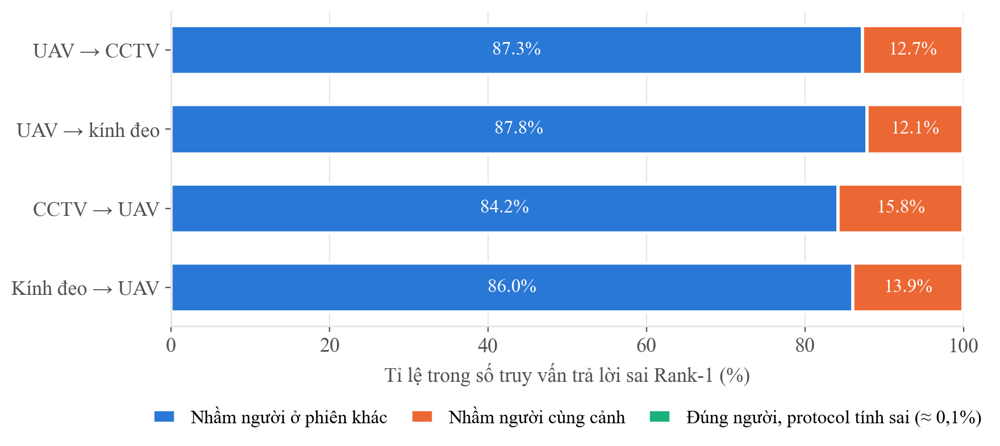

**Đề tài NCKH cấp Trường 2026–2027:** *Nghiên cứu và phát triển drone có khả năng
theo dõi người thông qua mô tả bằng lời nói*

**Đề tài con 2 (ĐT2):** Bàn giao mục tiêu từ camera mặt đất sang drone

**Người thực hiện:** Nguyễn Văn Vinh (TV2) · **Chủ nhiệm đề tài:** ThS. Lê Thị Thùy Trang

**Thời gian:** 04/10 – 08/10/2026 · **Kho mã nguồn:** github.com/VINH1811/NCKH-DO_AN-DRONE

# 1. Tóm tắt

Trong đợt test, tôi hoàn thành **4 việc riêng của ĐT2** (VN-01 đến VN-04), **1 việc
chung của cả nhóm** (C-03 — quy ước thống kê) và **hồ sơ pilot M4** cùng Lương. Ngoài
ra tôi xây bộ công cụ dùng chung cho cả ba đề tài và đánh giá khả năng dùng dữ liệu
cũ thay cho buổi quay pilot.

| Mã việc | Nội dung | Hạn | Trạng thái | Kết quả chính |
|---|---|---|---|---|
| VN-01 / M1 | Giao gói dữ liệu SecondPaper cho Lương | 04/10 | Xong | 98.552 ảnh, 250 mô tả, 500 file ghi âm; toàn vẹn 510/510 |
| VN-02 | Môi trường OSNet, tải AG-ReID.v2, khoá hash | 04/10 | Xong | 2 checkpoint đã xác minh nguồn; 100.502 ảnh AG-ReID.v2 |
| VN-03 | Baseline OSNet trên 4 protocol | 05/10 | Xong | Rank-1 tốt nhất 33,62%; AIN hơn MSMT17 2,3–3,5 lần |
| C-03 | Quy ước thống kê chung | 05/10 | Xong, nhóm đã đồng ý | Công cụ chung, so sánh cặp, luật cho metric hiếm lần trúng |
| M4 | Hồ sơ kế hoạch thu pilot | 06/10 | Xong, cô đã duyệt | 5 tài liệu PDF |
| VN-04 | Phân tích lỗi theo góc nhìn | 06/10 | Xong (nộp 07/10) | Thu hẹp ứng viên làm Rank-1 tăng gần gấp đôi |
| — | Đánh giá dữ liệu cũ thay pilot | 07/10 | Xong | Dùng được cho CH1, không dùng được cho CH2 |
| VN-05, VN-06 | Thu pilot phiên 1, 2 | 07–08/10 | Chưa quay | — |

Mọi con số trong báo cáo đều kèm cỡ mẫu **n**, **khoảng tin cậy 95%** (bootstrap 1.000
lần) và **mức ngẫu nhiên** theo quy ước C-03. Toàn bộ số liệu chi tiết nằm trong file
thống kê kèm theo: **ThongKe_DT2_NguyenVanVinh.xlsx** (9 trang tính).

# 2. VN-01 — Gói dữ liệu SecondPaper giao cho Lương (mốc M1)

**Việc đã làm.** Viết script `dong_goi_m1.py` đóng gói toàn bộ dữ liệu SecondPaper,
xuất manifest dạng CSV, xuất embedding sang `.npy` để không phải giải mã BLOB trong
SQLite, tính SHA256 cho mọi file và tự sinh README hướng dẫn sử dụng. Gộp thành một
file `.tar` để chuyển nhanh, giao trực tiếp qua USB vì dữ liệu chứa ảnh người thật.

| Thành phần | Số mục | Dung lượng |
|---|---:|---:|
| Ảnh cắt người | 98.549 | 557 MB |
| Embedding (768 chiều, chuẩn hoá L2) | 98.552 | 303 MB |
| Cơ sở dữ liệu `index.db` | 1 | 415 MB |
| Mô tả tiếng Việt có ghi âm | 250 | — |
| File ghi âm (mô tả + nhiều người nói) | 500 | 124 MB |
| **Gói `.tar`** | 99.071 mục | **1,49 GB** |

**Kết quả.** Kiểm tra toàn vẹn đạt **510/510 file**. Lương dùng gói này chạy được
LG-02 và LG-03.

**Ba vấn đề phát hiện khi đóng gói, đã ghi cảnh báo trong README:**

1. Con số **93.548 ảnh** trong bảng tiến độ **không tái lập được** từ cơ sở dữ liệu
   hiện tại — đã thử mọi cách lọc. Từ nay lấy manifest trong gói làm mốc chính thức.
2. Embedding trong gói là **768 chiều** (M-CLIP ViT-L/14), **không dùng chung được**
   với mô hình 512 chiều mà LG-01 định tải. LG-03 phải tự nhúng lại ảnh.
3. Bảng mô tả có 409 dòng nhưng chỉ **250 dòng có nội dung**; đã lọc sẵn.

Ngoài ra, cột `camera` chỉ có 5 giá trị (tên khu vực) trong khi dữ liệu có 9 nguồn
quay; tôi tách sẵn cột `camera_id` để phân tích theo nguồn không bị gộp nhầm.

# 3. VN-02 — Môi trường và khoá hash checkpoint

**Việc đã làm.** Kiểm tra môi trường, tải bộ dữ liệu AG-ReID.v2 từ kho chính thức của
tác giả, tải hai checkpoint OSNet từ Model Zoo của torchreid, viết script
`ghi_moi_truong.py` ghi lại phiên bản thư viện, phần cứng, commit và khoá SHA256 của
checkpoint.

| Hạng mục | Giá trị |
|---|---|
| Phần cứng | NVIDIA RTX 3060 Laptop 6 GB, driver 546.30 |
| Phần mềm | Python 3.12, torch 2.7.1 + CUDA 11.8, torchreid 0.2.5 |
| AG-ReID.v2 | 100.502 ảnh, 1.615 danh tính, 4 protocol chính thức |
| Checkpoint 1 | OSNet-AIN đa nguồn (MSMT17 + Duke + CUHK03) — 2.510 danh tính |
| Checkpoint 2 | OSNet MSMT17 — 1.041 danh tính |

**Cách xác minh tải đúng checkpoint:** script đọc số danh tính ở tầng phân loại của
file trọng số. Con số 2.510 khớp chính xác 1.041 + 702 + 767 (tổng số danh tính của
ba tập huấn luyện); 1.000 sẽ nghĩa là lỡ tải bản ImageNet. Cách này tin cậy hơn tên
file.

# 4. VN-03 — Baseline OSNet trên AG-ReID.v2

**Việc đã làm.** Viết script `eval_agreid.py` chạy đúng **bốn protocol chính thức**
do tác giả cung cấp, không chỉnh sửa. Script tự tính Rank-1/5/10, mAP, khoảng tin cậy
bootstrap, mức ngẫu nhiên bằng mô phỏng, đo tốc độ và lưu dự đoán thô.

| Chiều | n | OSNet-AIN đa nguồn | OSNet MSMT17 | Hiệu cặp |
|---|---:|---|---|---|
| UAV → CCTV | 2.356 | **33,62%** [31,79 – 35,61] | 9,55% | +24,07 [+22,28 – +25,89] |
| CCTV → UAV | 1.811 | **27,89%** [25,73 – 30,09] | 9,00% | +18,88 [+16,84 – +20,98] |
| UAV → kính đeo | 2.209 | **26,53%** [24,72 – 28,48] | 8,78% | +17,75 [+15,80 – +19,69] |
| Kính đeo → UAV | 2.340 | **20,13%** [18,46 – 21,67] | 8,72% | +11,41 [+9,87 – +12,99] |

**Kết quả.**

- **Huấn luyện khái quát miền vượt trội:** OSNet-AIN đa nguồn hơn OSNet MSMT17 từ
  **2,3 đến 3,5 lần** ở cả bốn chiều; cả tám phép so sánh cặp đều có ý nghĩa.
- **Camera mặt đất đặt cao khớp tốt hơn:** CCTV (~3 m) bắt cặp với UAV tốt hơn kính
  đeo (~1,5 m) ở cả hai chiều. Đây là căn cứ chọn vị trí đặt máy cho pilot.
- **Chiều mặt đất → trên cao khó hơn**, mà đó chính là chiều của bài toán bàn giao.
  Con số dùng để đặt kỳ vọng là **27,89%**.
- **Tốc độ:** 1,16 ms/ảnh cho riêng mô hình, 1,90 ms/ảnh cho cả pipeline (fp32).

**Bốn lỗi phát hiện và sửa khi chạy thử** — nếu không bắt, cả bốn sẽ cho số sai hoặc
chặn việc chạy: Rank-10 bị tính thành 100% do kẹp chỉ số sai; chỉ báo "truy vấn
không có đáp án" đo nhầm; script ghi môi trường vỡ khi checkpoint lưu số kiểu numpy;
torch 2.6 trở lên từ chối nạp checkpoint torchreid. Lỗi cuối cùng cả Việt và Lương
đều sẽ gặp, nên tôi ghi cách xử lý vào README chung.

# 5. C-03 — Quy ước thống kê chung cho cả nhóm

**Việc đã làm.** Viết công cụ `common/bootstrap_ci.py` dùng chung cho ba đề tài, soạn
mục "Quy ước thống kê" trong README chung, gộp với bản đề xuất của Lương thành một
quy ước thống nhất. Cả nhóm đã đồng ý.

Nội dung chính của quy ước:

1. Mỗi con số phải kèm **n, đơn vị lấy mẫu, mức ngẫu nhiên, khoảng tin cậy 95% và tên
   phương pháp**.
2. So sánh hai cấu hình dùng **so sánh cặp trên cùng truy vấn**, không nhìn hai khoảng
   tin cậy có chồng nhau hay không.
3. Với metric hiếm lần trúng: kết luận "vượt ngẫu nhiên" lấy theo **kiểm định hoán vị
   một phía**; khoảng tin cậy lấy theo **bootstrap theo cụm**; dưới 5 lần trúng thì
   ghi rõ khoảng bootstrap bị suy biến.

**Kết quả — hai bằng chứng cho thấy quy ước không phải hình thức:**

| Trường hợp | Cách cũ | Theo quy ước C-03 |
|---|---|---|
| ĐT1: YOLO11s và YOLO-World, n = 520 ảnh | Hai khoảng chồng nhau → không chốt được detector | Hiệu +1,58 [+1,05 – +2,15] → **có ý nghĩa**, YOLO11s hơn ở 59,2% số ảnh |
| ĐT3: Recall@1 = 2/70 | Khoảng bootstrap [0,00 – 7,14] chứa mức ngẫu nhiên → "chưa đủ bằng chứng" | Kiểm định hoán vị p = 0,000135 → **vượt ngẫu nhiên** |

Ở cả hai trường hợp, cách cũ dẫn tới kết luận **thận trọng quá mức** và sai.

Điểm mấu chốt: "có vượt ngẫu nhiên không" và "con số dao động bao nhiêu" là **hai câu
hỏi khác nhau**. Tương quan giữa các truy vấn ảnh hưởng tới câu thứ hai nhưng không
ảnh hưởng tới câu thứ nhất, nên mỗi câu cần công cụ riêng.

# 6. Công cụ dùng chung cho nhóm

Ngoài công cụ thống kê, tôi viết thêm ba công cụ mà README chung có nhắc nhưng chưa
ai làm:

| Công cụ | Chức năng | Kết quả |
|---|---|---|
| `chuan_hoa_metrics.py` | Đưa file metrics bất kỳ về đúng mẫu 17 cột, giữ nguyên file gốc | Đã chuyển 2 file của Việt |
| `gop_metrics.py` | Gộp metrics ba đề tài thành một bảng | `docs/metrics_tong_hop.csv`, **261 dòng** |
| `md_sang_pdf.py` | Xuất tài liệu ra PDF đúng quy cách Times New Roman | Dùng cho hồ sơ M4 và báo cáo này |

# 7. Hồ sơ kế hoạch thu pilot (mốc M4)

**Việc đã làm.** Soạn cùng Lương bộ hồ sơ 5 tài liệu PDF trình chủ nhiệm:

| Tài liệu | Nội dung |
|---|---|
| Tờ trình | Tóm tắt kế hoạch, cam kết dữ liệu, ô ý kiến và chữ ký của chủ nhiệm |
| Phiếu đồng ý tham gia | Phát cho người tham gia ký |
| Kế hoạch vị trí quay | Tiêu chí chọn chỗ, cách đặt và cài đặt máy quay |
| Kịch bản 2 phiên | Quy trình từng buổi, phân công, phương án dự phòng |
| Hướng dẫn viết mô tả | Bản khung để Lương hoàn thiện (LG-04) |

**Điểm chính của hồ sơ:** không bay drone ở đợt pilot mà lấy góc cao từ tầng 4–6
(khoảng 15–20 m, nằm trong dải 15–45 m của AG-ReID.v2); vị trí đặt máy dựa trên số
liệu VN-03; cam kết dữ liệu cá nhân viết thành điều khoản cụ thể (không nhận diện
khuôn mặt, gán mã số thay tên, xoá video gốc sau 90 ngày, cho rút dữ liệu).

**Kết quả.** Chủ nhiệm **đã duyệt** (mốc C-04).

# 8. VN-04 — Phân tích lỗi theo góc nhìn

**Việc đã làm.** Viết script `vn04_phan_tich_loi.py` phân tích lại dự đoán thô của
VN-03, **không cần chạy lại GPU**. Năm phân tích: theo độ cao bay, theo cỡ người
trong ảnh, phân loại lỗi, Rank-1 tính theo người, và thu hẹp ứng viên về cùng phiên.

## 8.1. Bay càng cao, nhận lại càng kém

| Chiều | Bay thấp | Bay vừa | Bay cao | Thấp − cao |
|---|---:|---:|---:|---|
| UAV → CCTV | 36,84% | 33,26% | 30,15% | +6,69 [+1,90 – +11,34] |
| UAV → kính đeo | 33,58% | 26,44% | 19,47% | +14,11 [+9,26 – +18,50] |
| **CCTV → UAV** | **40,00%** | 25,00% | **17,31%** | **+22,69** [+17,43 – +27,97] |
| Kính đeo → UAV | 31,84% | 16,59% | 13,00% | +18,84 [+14,77 – +23,16] |

Rank-1 giảm đều theo độ cao ở **cả bốn protocol**, mọi khác biệt đều có ý nghĩa. Mức
giảm lớn nhất rơi đúng vào chiều của bài toán bàn giao (CCTV → UAV, **giảm 22,7 điểm**).

## 8.2. Vì sao: góc nhìn, không chỉ vì người nhỏ đi

So người to với người nhỏ **trong cùng một độ cao**: ở độ cao thấp, người to hơn trong
ảnh dễ khớp hơn rõ rệt (+11,01 và +13,33 điểm, có ý nghĩa). Ở độ cao lớn, **chưa thấy**
cỡ người tạo khác biệt ở cả hai protocol. Khi nhìn gần như thẳng từ trên xuống, ảnh
chủ yếu thấy đầu và vai, phần trang phục phía trước không còn trong khung — ảnh to hơn
cũng không lấy lại được thông tin đó.

→ **Muốn xác nhận đúng người, drone phải hạ độ cao; phóng to ảnh không thay được.**

## 8.3. Khi sai thì sai kiểu gì

84–88% lỗi là **nhầm với người ở phiên quay khác hẳn**, 12–16% là nhầm người cùng
cảnh. Chỉ **0,1%** là "đúng người nhưng protocol tính sai".

Giả thuyết ban đầu rằng cách protocol định nghĩa danh tính làm méo con số **đã bị bác
bỏ**: Rank-1 tính lại theo người chỉ tăng +0,04 đến +0,06 điểm. Con số chính thức dùng
được nguyên vẹn.

## 8.4. Thu hẹp ứng viên — kết quả quan trọng nhất cho ĐT2

Gallery của benchmark trộn người từ nhiều ngày quay (trung bình gần 10.000 ảnh). Khi
chỉ so với người **cùng phiên** (gallery nhỏ đi khoảng 9 lần), Rank-1 **tăng gần gấp
đôi** ở cả bốn protocol; với chiều CCTV → UAV từ **27,89% lên ít nhất 49,75%**.

**Ý nghĩa:** đây là căn cứ định lượng cho thiết kế của ĐT2. Dùng camera mặt đất định
vị người trước (câu hỏi CH1), rồi drone chỉ so khớp ngoại hình với những người quanh
vị trí đó, trong khoảng thời gian đó. **Định vị không chỉ để dẫn đường cho drone mà
trực tiếp làm tăng độ chính xác nhận lại người.**

## 8.5. Nguyên lý rút ra

Ghép VN-03 với VN-04: camera mặt đất đặt **cao hơn** thì khớp tốt hơn, drone bay
**thấp hơn** thì khớp tốt hơn. **Điều quyết định là khoảng cách góc nhìn giữa hai
camera** — nâng camera mặt đất và hạ drone đều thu hẹp khoảng cách đó.

# 9. Đánh giá dữ liệu cũ thay cho buổi quay pilot

**Việc đã làm.** Kiểm tra cả 9 nguồn quay đã có, xem khung hình mẫu để xác định góc
quay, đối chiếu thời gian quay giữa các nguồn, và đo độ ổn định của máy quay.

**Kết quả.**

- Trong 9 nguồn, **chỉ có `SanTruong3`** (21/07/2026) quay từ tầng cao nhìn xuống. Tám
  nguồn còn lại quay ngang tầm mắt, một số cầm tay.
- **Không có hai nguồn nào quay cùng lúc ở cùng chỗ.** Các "Cam1/2/3" ở canteen thực
  chất là ba đoạn quay nối tiếp, không phải ba máy song song.
- Máy quay `SanTruong3` bị chỉnh một lần ở đầu buổi, sau đó **trôi chậm và đều**, lệch
  tối đa **11,6 điểm ảnh sau gần 2 tiếng** (1,8% bề rộng khung). Riêng 30 phút đầu lệch
  dưới 3 điểm ảnh.

| Pilot cần | Dữ liệu cũ |
|---|---|
| CH1 — định vị (camera cố định, điểm mốc đo bằng thước) | **Dùng được `SanTruong3`**, cần nắn khung để bù độ trôi |
| CH2 — nhận lại cùng một người từ hai góc cùng lúc | **Không dùng được** — không có nguồn nào quay đồng thời |

**Đề xuất:** quay pilot tại đúng vị trí của `SanTruong3` (máy góc cao ở cùng tầng, cùng
ô cửa) và đặt thêm một máy mặt đất. Bộ điểm mốc đo một lần sẽ hiệu chuẩn được cả buổi
quay mới lẫn hai tiếng video cũ. Người trong video cũ chưa ký phiếu đồng ý theo hồ sơ
M4, nên cần báo chủ nhiệm trước khi dùng.

**Đính chính:** trong gói M1, nhóm nguồn `edata` được mô tả là "9 camera cố định". Khung
hình cho thấy phần lớn là điện thoại quay ngang tầm mắt, nên cách gọi đúng là **"9
nguồn quay"**.

# 10. Việc còn lại

| Việc | Hạn | Ghi chú |
|---|---|---|
| VN-05, VN-06 — thu pilot 2 phiên, gán nhãn, hiệu chuẩn | 07–08/10 | Chưa quay. Hai phiên phải khác ngày, cùng khung giờ |
| VN-07 — nhận lại người mặt đất → góc cao trên pilot | 09/10 | Phụ thuộc pilot |
| VN-08 — test cố định trên phiên 2 | 10/10 | Phụ thuộc pilot |
| VN-09 — báo cáo ngắn, kiểm tra chéo kết quả của Việt | 11/10 | — |
| Điền địa điểm và khung giờ vào hồ sơ M4 | — | Hai ô còn để trống |

Nếu không kịp quay pilot, phương án dự phòng đã ghi trong kế hoạch: CH2 báo cáo trên
AG-ReID.v2 (đã có từ VN-03, VN-04), CH1 báo cáo trên `SanTruong3`.

# Phụ lục — Nơi lưu kết quả

| Kết quả | Vị trí trong kho mã | Commit |
|---|---|---|
| VN-02, VN-03 | `dt2_handoff/`, `reports/VN03_baseline.md` | de6903b |
| C-03 | `common/bootstrap_ci.py`, README mục 4 | 298f470, 9d3752b, 74183e5 |
| Công cụ chuẩn hoá, gộp bảng | `common/`, `docs/metrics_tong_hop.csv` | 005ee99 |
| Hồ sơ M4 | `docs/pilot/` | 7d15a3c |
| VN-04 | `reports/VN04_phan_tich_loi.md` | 6a92e3c |
| Gói M1 | `D:/giao_Luong/SecondPaper_M1.tar` (ngoài kho, chứa ảnh người) | — |
| File thống kê | `ThongKe_DT2_NguyenVanVinh.xlsx` | kèm báo cáo này |
