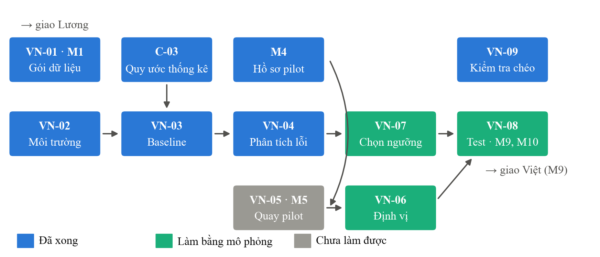
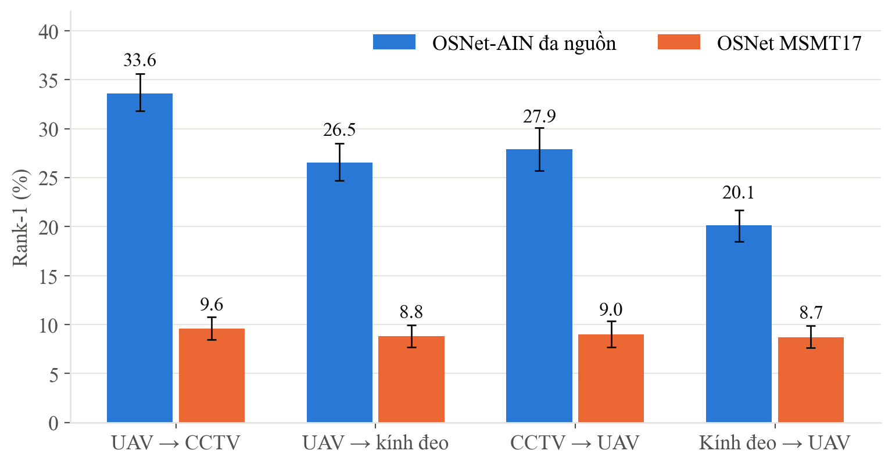
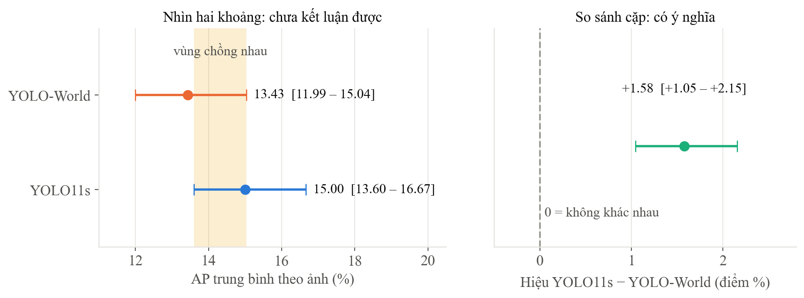
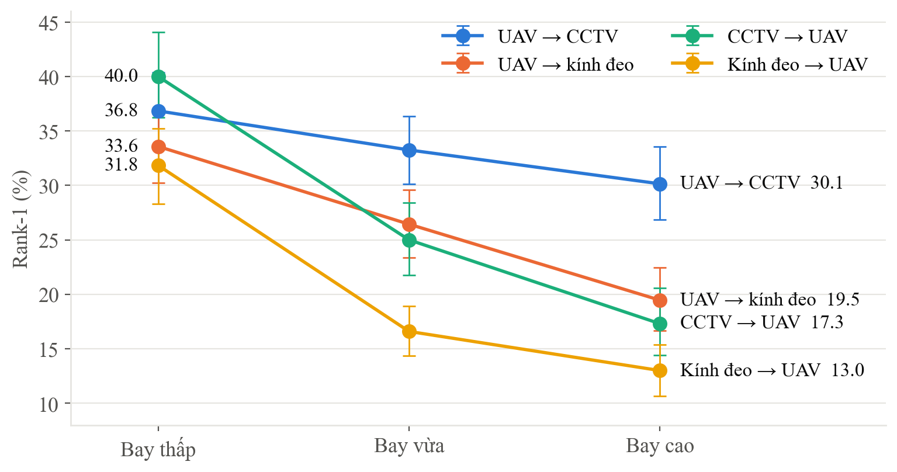
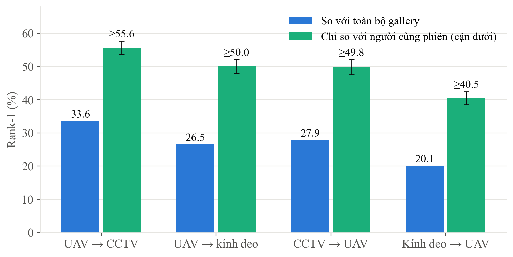
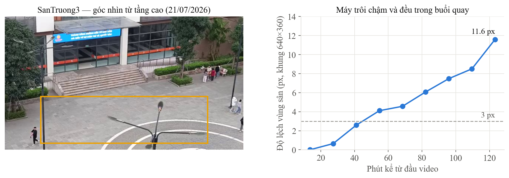
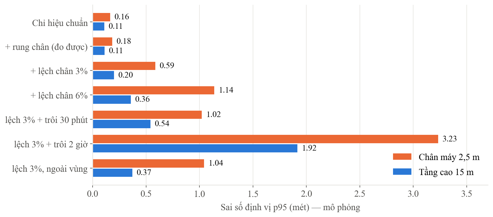
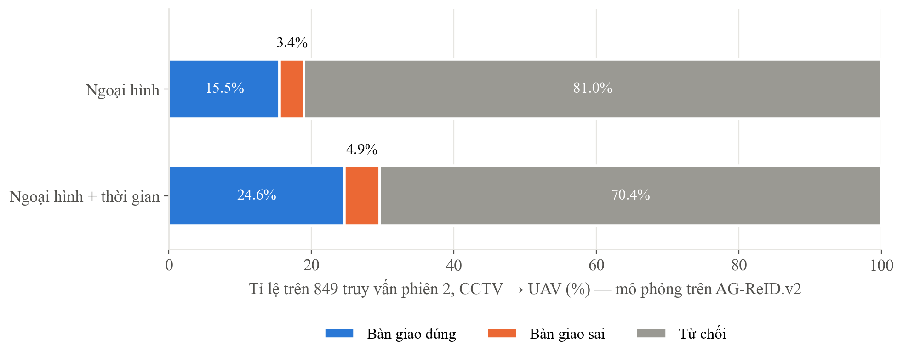
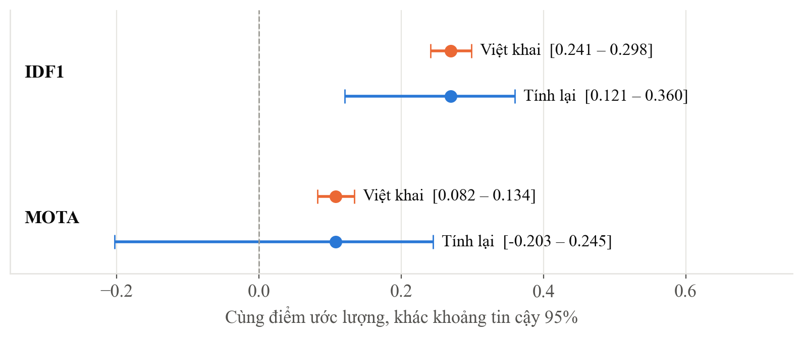

**Đề tài NCKH cấp Trường 2026–2027:** *Nghiên cứu và phát triển drone có khả năng
theo dõi người thông qua mô tả bằng lời nói*

**Đề tài con 2 (ĐT2):** Bàn giao mục tiêu từ camera mặt đất sang drone

**Người thực hiện:** Nguyễn Văn Vinh (TV2) · **Chủ nhiệm:** ThS. Lê Thị Thùy Trang

**Đợt test:** 04/10 – 11/10/2026 · **Kho mã nguồn:**
[github.com/VINH1811/NCKH-DO_AN-DRONE](https://github.com/VINH1811/NCKH-DO_AN-DRONE)

# Phần A. Tổng quan

## A.1. Các nhiệm vụ và trạng thái

ĐT2 trả lời câu hỏi: **khi camera mặt đất đã thấy một người, làm sao chuyển người đó
cho drone một cách đúng và an toàn?** Bài toán gồm ba câu hỏi nghiên cứu: định vị
người trên bản đồ (CH1), nhận lại cùng một người từ góc nhìn trên cao (CH2), và quy
trình bàn giao (CH3).

| Mã | Nhiệm vụ | Hạn | Trạng thái | Kết quả một dòng |
|---|---|---|---|---|
| VN-01 · M1 | Giao gói dữ liệu cho Lương | 04/10 | Xong | 98.552 ảnh, 250 mô tả, 500 ghi âm; toàn vẹn 510/510 |
| VN-02 | Môi trường, dữ liệu, khoá checkpoint | 04/10 | Xong | 2 checkpoint đã xác minh; AG-ReID.v2 100.502 ảnh |
| VN-03 | Baseline nhận lại người | 05/10 | Xong | Rank-1 cao nhất 33,62%; huấn luyện khái quát miền hơn 2,3–3,5 lần |
| C-03 | Quy ước thống kê cả nhóm | 05/10 | Xong | Công cụ chung; so sánh cặp; luật cho metric hiếm lần trúng |
| M4 | Hồ sơ pilot | 06/10 | Xong, đã duyệt | 5 tài liệu PDF |
| VN-04 | Phân tích lỗi theo góc nhìn | 06/10 | Xong | Thu hẹp ứng viên làm Rank-1 tăng gần gấp đôi |
| — | Đánh giá dữ liệu cũ | 07/10 | Xong | Dùng được cho CH1, không cho CH2 |
| VN-05 · M5 | Quay pilot | 07/10 | **Chưa làm được** | — |
| VN-06 | Sai số định vị | 08/10 | **Mô phỏng** | Độ trôi máy quay là nguồn sai lớn nhất |
| VN-07 | Chọn ngưỡng bàn giao | 09/10 | **Mô phỏng** | Ngưỡng chốt trên phiên 1 |
| VN-08 · M9 · M10 | Test bàn giao, giao Việt | 10/10 | **Mô phỏng** | Độ chính xác khi bàn giao 83,3% |
| VN-09 | Kiểm tra chéo ĐT1 | 11/10 | Xong | Số chính đúng; 4 mục đóng gói cần sửa |

**Về chữ "mô phỏng":** hai phiên pilot trong khuôn viên chưa quay được. Theo phương án
dự phòng ghi ở mốc M6, VN-06 → VN-08 được làm trên dữ liệu có sẵn. Các kết quả đó
**không phải** số đo trong khuôn viên trường và luôn được ghi tách riêng.

## A.2. Cách đọc kho mã nguồn

Toàn bộ phần của ĐT2 nằm trong thư mục `dt2_handoff/`:

| Thư mục | Chứa gì | Đọc thế nào |
|---|---|---|
| `reports/` | Báo cáo từng nhiệm vụ (`.md`) | Mở trực tiếp trên GitHub, đọc như văn bản |
| `metrics/` | Bảng số liệu (`.csv`) | Mở bằng Excel; mỗi dòng là **một chỉ số** của một lần chạy |
| `predictions/` | Dự đoán thô từng truy vấn | Dùng để tính lại chỉ số mà không cần GPU |
| `src/` | Mã nguồn | Lệnh chạy ghi ở cuối mỗi báo cáo |
| `configs/` | Cấu hình từng lần chạy | Tham số và lệnh đã dùng |
| `env/` | Môi trường từng lần chạy | Phiên bản thư viện, GPU, mã commit |
| `checkpoints/` | Mã băm trọng số | Trọng số không đưa lên git, chỉ lưu mã băm để đối chiếu |
| `handoff_M1/`, `handoff_M9/` | Bằng chứng bàn giao cho Lương, Việt | Có README riêng |

**Cách đọc một file metrics.** Mọi file `metrics/*.csv` theo cùng một mẫu 17 cột của
nhóm. Các cột quan trọng:

| Cột | Nghĩa |
|---|---|
| `split` | Protocol hoặc nhóm dữ liệu, ví dụ `exp4_cctv_to_aerial` là CCTV → UAV |
| `metric`, `value` | Tên chỉ số và giá trị (phần trăm, trừ khi tên ghi đơn vị khác) |
| `ci95_low`, `ci95_high` | Khoảng tin cậy 95% |
| `n` | Số truy vấn tạo ra con số |
| `chance_level` | Điểm nếu đoán ngẫu nhiên — để biết con số có ý nghĩa hay không |
| `notes` | Giải thích điều kiện chạy |

**Cách đọc khoảng tin cậy.** "33,62% [31,79 – 35,61]" nghĩa là nếu lấy một bộ truy vấn
khác cùng cỡ, con số nhiều khả năng nằm trong khoảng đó. Hai cấu hình được coi là
khác nhau thật khi **khoảng tin cậy của hiệu** giữa chúng không chứa 0 (quy ước C-03).

# Phần B. Chi tiết từng nhiệm vụ

## B.1. VN-01 — Giao gói dữ liệu cho Lương (mốc M1)

**Mục đích.** Giao cho Lương toàn bộ dữ liệu cần để chạy baseline tìm kiếm người theo
mô tả (LG-02, LG-03).

**Ý nghĩa.** Là mốc đầu chuỗi: trễ thì ĐT3 không bắt đầu được. Việc đóng gói còn là
dịp kiểm toán dữ liệu cũ trước khi người khác dùng.

**Kết quả.**

- Gói 1,49 GB: 98.549 ảnh người, embedding 768 chiều, 250 mô tả tiếng Việt có ghi âm,
  500 file ghi âm. Kiểm tra toàn vẹn **510/510 file**.
- Phát hiện **3 vấn đề dữ liệu** và ghi cảnh báo trong gói: con số 93.548 ảnh trong
  bảng tiến độ không tái lập được; embedding 768 chiều không dùng chung được với mô
  hình 512 chiều; bảng mô tả có 409 dòng nhưng chỉ 250 dòng có nội dung.
- Lương đã dùng gói này chạy được LG-02 và LG-03.

**Dẫn chứng trên git.**

| File | Cách đọc |
|---|---|
| [handoff_M1/README_goi_M1.md](https://github.com/VINH1811/NCKH-DO_AN-DRONE/blob/main/dt2_handoff/handoff_M1/README_goi_M1.md) | README kèm trong gói, có số liệu và 3 cảnh báo |
| [handoff_M1/thong_ke.json](https://github.com/VINH1811/NCKH-DO_AN-DRONE/blob/main/dt2_handoff/handoff_M1/thong_ke.json) | Số lượng từng thành phần |
| [handoff_M1/SHA256SUMS.txt](https://github.com/VINH1811/NCKH-DO_AN-DRONE/blob/main/dt2_handoff/handoff_M1/SHA256SUMS.txt) | Mã băm 510 file, đối chiếu với gói Lương giữ |
| [src/dong_goi_m1.py](https://github.com/VINH1811/NCKH-DO_AN-DRONE/blob/main/dt2_handoff/src/dong_goi_m1.py) | Script đóng gói |

Gói thật chứa ảnh người nên **không đưa lên git**, giao trực tiếp qua USB.

## B.2. VN-02 — Môi trường, dữ liệu và khoá checkpoint

**Mục đích.** Dựng môi trường chạy được, tải bộ dữ liệu chuẩn AG-ReID.v2 và chọn trọng
số mô hình có công bố.

**Ý nghĩa.** Mọi kết quả sau đều dựa vào đây. Khoá mã băm bảo đảm nửa tháng sau vẫn
chứng minh được con số sinh từ trọng số nào.

**Kết quả.**

- RTX 3060 6 GB, Python 3.12, torch 2.7.1 + CUDA 11.8, torchreid 0.2.5.
- AG-ReID.v2: 100.502 ảnh, 1.615 danh tính, 4 protocol chính thức của tác giả.
- Hai checkpoint OSNet: bản đa nguồn (2.510 danh tính) và bản MSMT17 (1.041 danh tính).
  Số danh tính khớp chính xác tổng của các tập huấn luyện — cách xác minh đáng tin hơn
  tên file.

**Dẫn chứng trên git.**

| File | Cách đọc |
|---|---|
| [env/VN02-setup-20261004/](https://github.com/VINH1811/NCKH-DO_AN-DRONE/tree/main/dt2_handoff/env/VN02-setup-20261004) | `moi_truong.json`: GPU, CUDA, commit; `pip_freeze.txt`: thư viện |
| [checkpoints/SHA256SUMS](https://github.com/VINH1811/NCKH-DO_AN-DRONE/blob/main/dt2_handoff/checkpoints/SHA256SUMS) | Mã băm hai trọng số |
| [checkpoints/checkpoint.lock.json](https://github.com/VINH1811/NCKH-DO_AN-DRONE/blob/main/dt2_handoff/checkpoints/checkpoint.lock.json) | Kèm số danh tính của từng trọng số |
| [src/ghi_moi_truong.py](https://github.com/VINH1811/NCKH-DO_AN-DRONE/blob/main/dt2_handoff/src/ghi_moi_truong.py) | Script ghi môi trường và băm |

## B.3. VN-03 — Baseline nhận lại người giữa mặt đất và trên cao

**Mục đích.** Đo một mô hình nhận lại người có sẵn làm được tới đâu khi chuyển giữa
camera mặt đất và UAV, theo đúng protocol của bài báo gốc.

**Ý nghĩa.** Là mốc so sánh cho mọi cải tiến sau, và trả lời CH2 ở mức ban đầu.

**Kết quả.**

| Chiều | OSNet-AIN đa nguồn | OSNet MSMT17 | Hiệu cặp |
|---|---|---|---|
| UAV → CCTV | **33,62%** | 9,55% | +24,07 [+22,28 – +25,89] |
| CCTV → UAV | **27,89%** | 9,00% | +18,88 [+16,84 – +20,98] |
| UAV → kính đeo | **26,53%** | 8,78% | +17,75 [+15,80 – +19,69] |
| Kính đeo → UAV | **20,13%** | 8,72% | +11,41 [+9,87 – +12,99] |

- Huấn luyện khái quát miền hơn huấn luyện cùng miền **2,3–3,5 lần**, có ý nghĩa ở cả
  tám phép so.
- Camera mặt đất đặt cao (CCTV ~3 m) khớp với UAV tốt hơn camera thấp (~1,5 m).
- Chiều mặt đất → trên cao, cũng là chiều bàn giao thật, khó hơn: **27,89%**.

**Dẫn chứng trên git.**

| File | Cách đọc |
|---|---|
| [reports/VN03_baseline.md](https://github.com/VINH1811/NCKH-DO_AN-DRONE/blob/main/dt2_handoff/reports/VN03_baseline.md) | Báo cáo đầy đủ |
| [metrics/ket_qua_chuan.csv](https://github.com/VINH1811/NCKH-DO_AN-DRONE/blob/main/dt2_handoff/metrics/ket_qua_chuan.csv) | 24 dòng; lọc cột `metric` = `Rank1` hoặc `mAP`; dòng `_hieu_cap` là so sánh cặp |
| [predictions/VN03-ain-20261004/](https://github.com/VINH1811/NCKH-DO_AN-DRONE/tree/main/dt2_handoff/predictions/VN03-ain-20261004) | Thứ hạng thô từng truy vấn (`.npz`) |
| [src/eval_agreid.py](https://github.com/VINH1811/NCKH-DO_AN-DRONE/blob/main/dt2_handoff/src/eval_agreid.py) | Script đánh giá |

## B.4. C-03 — Quy ước thống kê chung cho cả nhóm

**Mục đích.** Thống nhất cách báo cáo con số cho cả ba đề tài để số liệu so được với
nhau và không ai kết luận sai.

**Ý nghĩa.** Là nền cho mọi kết luận "A tốt hơn B" trong báo cáo cuối của cả nhóm.

**Kết quả.** Quy ước gồm: mỗi con số kèm n, mức ngẫu nhiên, khoảng tin cậy và tên
phương pháp; so sánh hai cấu hình bằng **so sánh cặp trên cùng truy vấn**; với chỉ số
hiếm lần trúng, kết luận dựa trên **kiểm định hoán vị**. Cả nhóm đã đồng ý.

Hai bằng chứng quy ước cần thiết: so sánh hai detector của Việt (hai khoảng chồng
nhau, nhưng hiệu cặp +1,58 [+1,05 – +2,15] là có ý nghĩa); Recall@1 = 2/70 của Lương
(khoảng bootstrap chứa mức ngẫu nhiên, nhưng kiểm định hoán vị p = 0,000135 cho thấy
vượt ngẫu nhiên). Ở cả hai, cách cũ cho kết luận sai.

Kèm theo, tôi viết ba công cụ dùng chung: chuẩn hoá file metrics về mẫu 17 cột, gộp
metrics ba đề tài thành một bảng, xuất tài liệu ra PDF.

**Dẫn chứng trên git.**

| File | Cách đọc |
|---|---|
| [README.md mục 4](https://github.com/VINH1811/NCKH-DO_AN-DRONE/blob/main/README.md) | Toàn văn quy ước |
| [common/bootstrap_ci.py](https://github.com/VINH1811/NCKH-DO_AN-DRONE/blob/main/common/bootstrap_ci.py) | Công cụ khoảng tin cậy, so sánh cặp, kiểm định |
| [common/gop_metrics.py](https://github.com/VINH1811/NCKH-DO_AN-DRONE/blob/main/common/gop_metrics.py) | Gộp metrics ba đề tài |
| [docs/metrics_tong_hop.csv](https://github.com/VINH1811/NCKH-DO_AN-DRONE/blob/main/docs/metrics_tong_hop.csv) | Bảng gộp; lọc cột `de_tai` theo đề tài |

## B.5. M4 — Hồ sơ kế hoạch thu pilot

**Mục đích.** Xin phê duyệt thu dữ liệu trong khuôn viên trường.

**Ý nghĩa.** Bảo đảm thu dữ liệu đúng quy định về dữ liệu cá nhân; không có phê duyệt
thì không được quay.

**Kết quả.** 5 tài liệu: tờ trình, phiếu đồng ý tham gia, kế hoạch vị trí quay, kịch
bản 2 phiên, hướng dẫn viết mô tả. Không bay drone ở pilot mà lấy góc cao từ tầng
4–6. Cam kết không nhận diện khuôn mặt, gán mã số thay tên, xoá video sau 90 ngày.
**Chủ nhiệm đã duyệt** (mốc C-04).

**Dẫn chứng trên git:** [docs/pilot/](https://github.com/VINH1811/NCKH-DO_AN-DRONE/tree/main/docs/pilot) — 5 file PDF, mở trực tiếp.

## B.6. VN-04 — Phân tích lỗi theo góc nhìn

**Mục đích.** Hiểu vì sao và khi nào nhận lại người thất bại, để thiết kế bàn giao
tránh đúng chỗ đó.

**Ý nghĩa.** Biến con số baseline thành **quyết định thiết kế** cho drone: bay ở độ
cao nào, lọc ứng viên ra sao.

**Kết quả.**

- **Bay cao làm hại nhiều nhất ở chiều bàn giao thật**: CCTV → UAV từ 40,00% (bay
  thấp) xuống 17,31% (bay cao).
- Ở độ cao lớn, người to hơn trong ảnh cũng không khớp tốt hơn → nút thắt là **góc
  nhìn**, không phải độ phân giải. Drone muốn xác nhận người thì phải hạ độ cao.
- 84–88% lỗi là nhầm với người ở **phiên quay khác**. Giả thuyết "protocol tính oan"
  bị bác bỏ.

- **Kết quả quan trọng nhất:** thu hẹp ứng viên về cùng phiên quay làm Rank-1 tăng gần
  gấp đôi (CCTV → UAV: 27,89% lên ít nhất 49,75%). Định vị người trước rồi mới so khớp
  ngoại hình là đòn bẩy lớn nhất đo được.

**Dẫn chứng trên git.**

| File | Cách đọc |
|---|---|
| [reports/VN04_phan_tich_loi.md](https://github.com/VINH1811/NCKH-DO_AN-DRONE/blob/main/dt2_handoff/reports/VN04_phan_tich_loi.md) | Báo cáo đầy đủ |
| [metrics/VN04-phan-tich-loi-20261007.csv](https://github.com/VINH1811/NCKH-DO_AN-DRONE/blob/main/dt2_handoff/metrics/VN04-phan-tich-loi-20261007.csv) | 64 dòng; `metric` bắt đầu bằng `Rank1_docao_` là theo độ cao, `loi_` là loại lỗi, `cung_phien` là thu hẹp ứng viên |
| [src/vn04_phan_tich_loi.py](https://github.com/VINH1811/NCKH-DO_AN-DRONE/blob/main/dt2_handoff/src/vn04_phan_tich_loi.py) | Chạy trên CPU, không cần GPU |

## B.7. Đánh giá dữ liệu cũ thay cho buổi quay pilot

**Mục đích.** Xem có dùng video đã quay trước đó thay cho pilot được không.

**Ý nghĩa.** Nếu được thì đỡ một buổi quay; nếu không thì biết chính xác thiếu gì.

**Kết quả.**

- Trong 9 nguồn quay chỉ có **SanTruong3** là góc cao; không có hai nguồn nào quay
  cùng lúc ở cùng chỗ.
- Máy SanTruong3 trôi tối đa 11,6 điểm ảnh sau gần 2 giờ.
- Kết luận: **dùng được cho CH1** (định vị), **không dùng được cho CH2** (cần cùng một
  người thấy từ hai góc cùng lúc).

**Dẫn chứng trên git:** [reports/tong_ket/BaoCao_TongKet_DT2_NguyenVanVinh.pdf](https://github.com/VINH1811/NCKH-DO_AN-DRONE/blob/main/dt2_handoff/reports/tong_ket/BaoCao_TongKet_DT2_NguyenVanVinh.pdf), mục 9.

## B.8. VN-06 — Sai số định vị (mô phỏng)

**Mục đích.** Ước lượng định vị người trên bản đồ sai bao nhiêu mét (CH1).

**Ý nghĩa.** Sai số định vị quyết định vùng drone phải tìm. Biết trước nguồn sai lớn
nhất thì buổi quay thật không lãng phí.

**Kết quả.** Chưa có điểm mốc đo bằng thước nên mô phỏng 2.000 lần quy trình hiệu chuẩn
4 điểm. Đầu vào đo thật: độ rung điểm chân (0,39% chiều cao người) và độ trôi máy của
SanTruong3. Phần còn lại là giả định, đã ghi rõ.

- Hiệu chuẩn bằng thước gần như không gây sai (~4 cm trung vị).
- **Máy quay bị trôi là nguồn sai lớn nhất**: sau 2 giờ, p95 lên 1,9–3,2 m.
- Máy đặt cao chịu sai lệch điểm chân tốt hơn hẳn máy thấp.
- → Khi quay thật: **kiểm tra mốc mỗi 30 phút**, điểm mốc phải bao hết vùng người đi.

## B.9. VN-07 và VN-08 — Chọn ngưỡng và test bàn giao (mô phỏng)

**Mục đích.** Dựng quy trình bàn giao hoàn chỉnh: chọn ngưỡng trên phiên 1, áp cố định
lên phiên 2, rồi đếm số lần bàn giao đúng, sai, và từ chối.

**Ý nghĩa.** Đây là câu hỏi vận hành thật: hệ thống được phép nhầm bao nhiêu, và trả
giá bằng bao nhiêu lần từ chối.

**Kết quả.** Dựng lại thiết kế pilot trên AG-ReID.v2: chia phiên theo ngày quay; thêm
ca **mục tiêu vắng mặt** (xoá người đúng khỏi danh sách); thêm ca **người mặc giống**.
Ngưỡng chọn sao cho khi mục tiêu vắng mặt, hệ thống nhận nhầm không quá 10%.

| Phiên 2, CCTV → UAV | Ngoại hình | + Giới hạn thời gian |
|---|---|---|
| Bàn giao đúng | 15,55% | **24,62%** |
| Bàn giao sai | 3,42% | 4,95% |
| Từ chối | 81,04% | 70,44% |
| Đúng trong số lần bàn giao | 81,99% | **83,27%** |
| Nhận nhầm khi mục tiêu vắng | 4,83% | 7,42% |

- Ngưỡng chọn trên phiên 1 **vẫn an toàn trên phiên 2** (dưới mức 10%).
- Giới hạn thời gian tăng bàn giao đúng **+9,07 điểm** [+7,18 – +10,95].
- Khi có người mặc giống mục tiêu, bàn giao sai tăng lên 6,75%.
- Camera thấp (kính đeo) chỉ đúng 60% trong số lần bàn giao → không dùng làm nguồn.
- Để giữ an toàn, hệ thống từ chối ~70% số ca. Bước nhận lại hiện chỉ nên **xác nhận**,
  chưa tự quyết bàn giao được.

**M9:** 251 mục tiêu đã xác minh (83,3% đúng) giao Việt, kèm ảnh mẫu để drone khoá lại.
**M10:** dự đoán thô từng truy vấn cho người kiểm tra chéo.

**Dẫn chứng trên git (VN-06 → VN-08).**

| File | Cách đọc |
|---|---|
| [reports/VN06-08_mo_phong_pilot.md](https://github.com/VINH1811/NCKH-DO_AN-DRONE/blob/main/dt2_handoff/reports/VN06-08_mo_phong_pilot.md) | Báo cáo đầy đủ, có thiết kế chốt trước khi chạy |
| [metrics/VN06-mo-phong-dinh-vi-20261010.csv](https://github.com/VINH1811/NCKH-DO_AN-DRONE/blob/main/dt2_handoff/metrics/VN06-mo-phong-dinh-vi-20261010.csv) | Cột `split` = cấu hình máy và kịch bản; `value` tính bằng mét |
| [metrics/VN0708-mo-phong-agreid-20261010.csv](https://github.com/VINH1811/NCKH-DO_AN-DRONE/blob/main/dt2_handoff/metrics/VN0708-mo-phong-agreid-20261010.csv) | `split` dạng `exp4_..._phien2_B`: protocol, phiên, điều kiện (A ngoại hình, B + thời gian) |
| [predictions/VN0708-mo-phong-agreid-20261010/](https://github.com/VINH1811/NCKH-DO_AN-DRONE/tree/main/dt2_handoff/predictions/VN0708-mo-phong-agreid-20261010) | Mỗi dòng một truy vấn: điểm, ngưỡng, quyết định, kết quả. `split_manifest_*.csv` ghi ngày nào thuộc phiên nào |
| [handoff_M9/](https://github.com/VINH1811/NCKH-DO_AN-DRONE/tree/main/dt2_handoff/handoff_M9) | `muc_tieu_xac_minh.json`; ý nghĩa từng trường ở README |
| [env/VN0708-mo-phong-20261010/](https://github.com/VINH1811/NCKH-DO_AN-DRONE/tree/main/dt2_handoff/env/VN0708-mo-phong-20261010) | Môi trường lần chạy, mã nguồn ở commit `e5c3682` |

## B.10. VN-09 — Kiểm tra chéo rút gọn kết quả của Việt (ĐT1)

**Mục đích.** Xác minh độc lập rằng kết quả ĐT1 nộp lên đúng và tái lập được.

**Ý nghĩa.** Là điều kiện nghiệm thu đợt test: không ai tự chấm kết quả của mình.

**Kết quả.**

- **Khớp:** IDF1 0,2699, MOTA 0,1078, 213 lần đổi ID tính lại chính xác từ 7 sequence;
  mã băm trọng số khớp; detector chạy thử đúng định dạng.
- **Cần sửa:** khoảng tin cậy ghi tay, không có mã nào tính ra, và hẹp hơn 4–8 lần so
  với tính lại; n = 2.746 không rõ nguồn; "heartbeat 20 Hz" là tham số cài đặt chứ
  không phải số đo; video demo được vẽ lại trên nền xám và chưa có trên git; gói M10
  chỉ có dự đoán 1/7 sequence.
- Phần chạy lại evaluator với nhãn gốc để dành cho kiểm tra chéo đầy đủ 12–13/10.

**Dẫn chứng trên git.**

| File | Cách đọc |
|---|---|
| [docs/crosscheck/dt1_follow.md](https://github.com/VINH1811/NCKH-DO_AN-DRONE/blob/main/docs/crosscheck/dt1_follow.md) | Biên bản: mục 1 đã khớp, mục 2–3 cần sửa |
| [docs/crosscheck/kiem_cheo_dt1.py](https://github.com/VINH1811/NCKH-DO_AN-DRONE/blob/main/docs/crosscheck/kiem_cheo_dt1.py) | Chạy lại mọi phép kiểm, không cần GPU |

# Phần C. Việc còn lại và giới hạn

| Việc | Ghi chú |
|---|---|
| Quay 2 phiên pilot thật | Hai phiên khác ngày, cùng khung giờ; kiểm tra mốc mỗi 30 phút |
| Chạy lại VN-06 → VN-08 trên pilot | Cùng script, chỉ đổi dữ liệu đầu vào |
| Thêm giới hạn vị trí vào bàn giao | Cần toạ độ từ hiệu chuẩn pilot |
| Nối chuỗi tìm kiếm → bàn giao → bám theo | Cần M8 từ Lương |
| Kiểm tra chéo đầy đủ ĐT1 (12–13/10) | Cần Việt commit đủ 7 sequence |
| Lịch dùng GPU (C-02) | Chưa ai lập; tốc độ đo chưa trong khung giờ riêng |

**Giới hạn cần nói rõ khi báo cáo:** VN-06 → VN-08 là mô phỏng; nhóm "giống áo" so theo
loại trang phục, chưa có màu; mọi kết quả nhận lại người mới trên một mô hình.

# Phụ lục. Danh sách commit chính

| Commit | Nội dung |
|---|---|
| `de6903b` | VN-02, VN-03 |
| `298f470`, `9d3752b`, `74183e5` | C-03 |
| `005ee99` | Công cụ chuẩn hoá và gộp metrics |
| `7d15a3c` | Hồ sơ pilot M4 |
| `6a92e3c` | VN-04 |
| `e5c3682`, `8427083` | VN-06 → VN-08, M9, M10 |
| `bd8a7d1` | VN-09 kiểm tra chéo ĐT1 |
